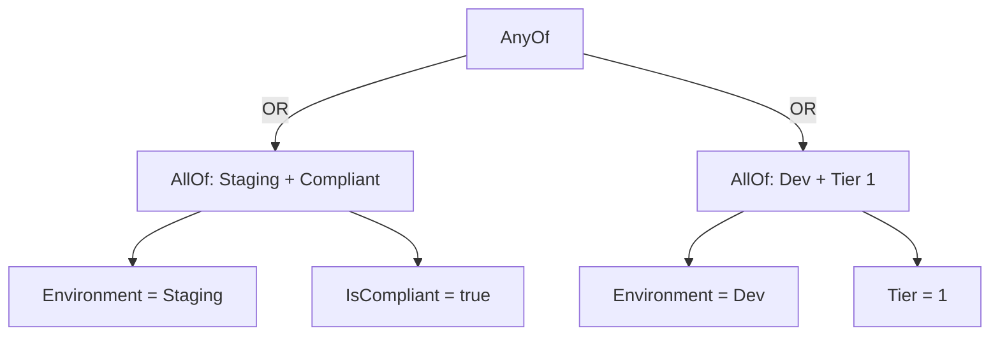

# Creating Feature Flags

This guide walks through building properties, conditions, rules, and flags -- from simple to complex.

## Define properties

Start by defining the properties your organization cares about. These form the schema for all your feature flag rules.

```powershell
# String property with allowed values
$env = New-Property -Name 'Environment' -Type string -EnumValues @('Production', 'Staging', 'Dev')

# Integer property with range validation
$tier = New-Property -Name 'Tier' -Type integer -Validation @{ Minimum = 1; Maximum = 3 }

# Boolean property
$compliant = New-Property -Name 'IsCompliant' -Type boolean

# Bundle into a PropertySet
$props = New-PropertySet -Name 'OrgProperties' -Properties @($env, $tier, $compliant)
$props | Save-PropertySet
```

Or author the JSON directly:

```json
{
    "$schema": "https://raw.githubusercontent.com/HeyItsGilbert/Gatekeeper/main/Gatekeeper/Schemas/Properties.json",
    "Environment": {
        "Type": "string",
        "Enum": ["Production", "Staging", "Dev"]
    },
    "Tier": {
        "Type": "integer",
        "Validation": { "Minimum": 1, "Maximum": 3 }
    },
    "IsCompliant": {
        "Type": "boolean"
    }
}
```

### Validation options

| Type | Validation fields | Purpose |
|------|-------------------|---------|
| `string` | `Enum`, `MinLength`, `MaxLength`, `Pattern` | Constrain allowed string values |
| `integer` | `Minimum`, `Maximum` | Constrain numeric range |
| `boolean` | *(none)* | True or false |

## Build conditions

A condition compares a single property against a value using an operator.

```powershell
# Simple: Environment equals Staging
$c1 = New-Condition -Property 'Environment' -Operator Equals -Value 'Staging'

# Numeric: Tier is less than 3
$c2 = New-Condition -Property 'Tier' -Operator LessThan -Value '3'

# Boolean: device is compliant
$c3 = New-Condition -Property 'IsCompliant' -Operator Equals -Value 'true'
```

## Group conditions

Use `New-ConditionGroup` to combine conditions with logical operators.

**AllOf** -- all must be true (AND):

```powershell
$group = New-ConditionGroup -Operator AllOf -Conditions @($c1, $c3)
# Staging AND compliant
```

**AnyOf** -- at least one must be true (OR):

```powershell
$group = New-ConditionGroup -Operator AnyOf -Conditions @($c1, $c2)
# Staging OR Tier < 3
```

**Not** -- invert a condition:

```powershell
$notProd = New-ConditionGroup -Operator Not -Conditions @(
    (New-Condition -Property 'Environment' -Operator Equals -Value 'Production')
)
# NOT Production
```

### Nesting

Groups nest to express complex logic:

```powershell
# (Staging AND compliant) OR (Dev AND Tier 1)
$staging = New-ConditionGroup -Operator AllOf -Conditions @(
    (New-Condition -Property 'Environment' -Operator Equals -Value 'Staging')
    (New-Condition -Property 'IsCompliant' -Operator Equals -Value 'true')
)
$dev = New-ConditionGroup -Operator AllOf -Conditions @(
    (New-Condition -Property 'Environment' -Operator Equals -Value 'Dev')
    (New-Condition -Property 'Tier' -Operator Equals -Value '1')
)
$either = New-ConditionGroup -Operator AnyOf -Conditions @($staging, $dev)
```



## Create rules

A rule combines conditions with an effect.

```powershell
$rule = New-Rule -Name 'Allow Compliant Staging' -Effect Allow -Conditions $staging
```

### Rule ordering

Rules are evaluated top-down. Put your most specific rules first.

```powershell
# Order matters:
$rules = @(
    (New-Rule -Name 'Audit all Production' -Effect Audit -Conditions $prodCondition)
    (New-Rule -Name 'Deny non-compliant'   -Effect Deny  -Conditions $nonCompliant)
    (New-Rule -Name 'Allow Staging'        -Effect Allow -Conditions $stagingCondition)
)
```

In this example, Production devices get audited first (Audit doesn't stop evaluation), then non-compliant devices are denied, and compliant Staging devices are allowed.

## Assemble the flag

```powershell
$flag = New-FeatureFlag -Name 'NewDashboard' `
    -Description 'Progressive rollout of the new dashboard UI' `
    -DefaultEffect Deny `
    -Rules $rules `
    -Tags @('UI', 'Dashboard') `
    -Author 'platform-team@contoso.com'

$flag | Save-FeatureFlag
```

### DefaultEffect

The `DefaultEffect` applies when no `Allow` or `Deny` rule matches. Set it to:

- **Deny** (recommended) -- feature is off unless explicitly allowed
- **Allow** -- feature is on unless explicitly denied
- **Warn** / **Audit** -- Gatekeeper returns `$false` but logs the evaluation

!!! warning
    `Test-FeatureFlag` returns `$false` unless the final effect is explicitly `Allow`. A DefaultEffect of `Warn` or `Audit` will still result in `$false`.

## A complete JSON example

```json
{
    "$schema": "https://raw.githubusercontent.com/HeyItsGilbert/Gatekeeper/main/Gatekeeper/Schemas/FeatureFlag.json",
    "Name": "NewDashboard",
    "Description": "Progressive rollout of the new dashboard UI.",
    "Version": "1.0.0",
    "Author": "platform-team@contoso.com",
    "Tags": ["UI", "Dashboard"],
    "DefaultEffect": "Deny",
    "Rules": [
        {
            "Name": "Audit Production",
            "Effect": "Audit",
            "Conditions": {
                "Property": "Environment",
                "Operator": "Equals",
                "Value": "Production"
            }
        },
        {
            "Name": "Allow compliant Staging",
            "Effect": "Allow",
            "Conditions": {
                "AllOf": [
                    { "Property": "Environment", "Operator": "Equals", "Value": "Staging" },
                    { "Property": "IsCompliant", "Operator": "Equals", "Value": "true" }
                ]
            }
        }
    ]
}
```
