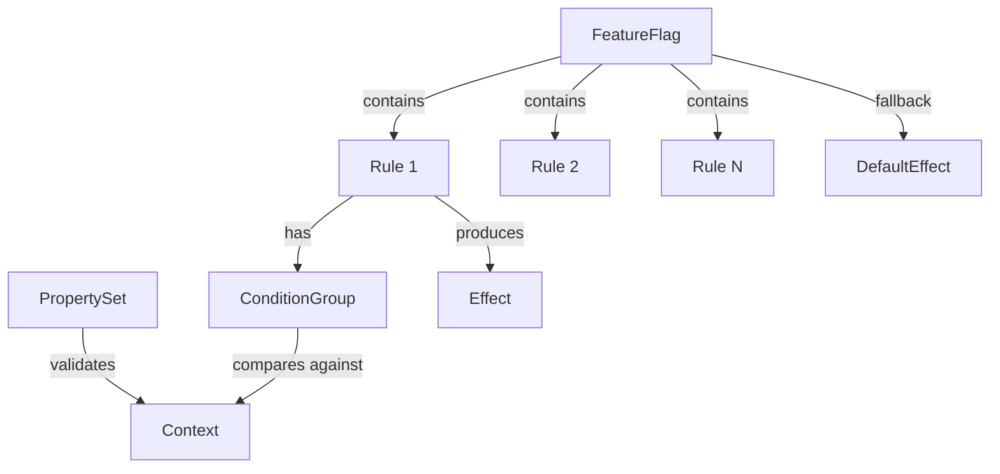
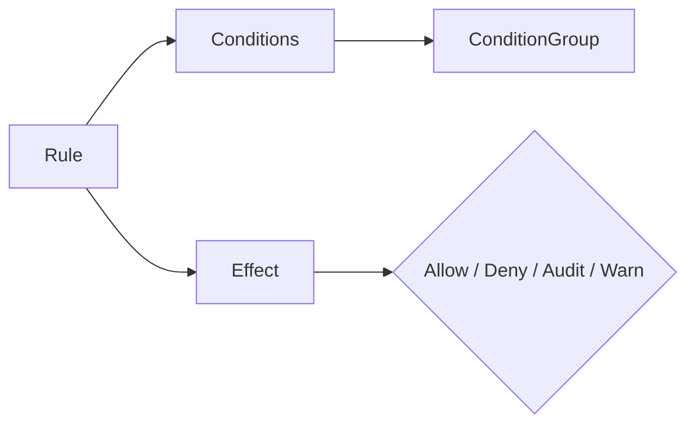
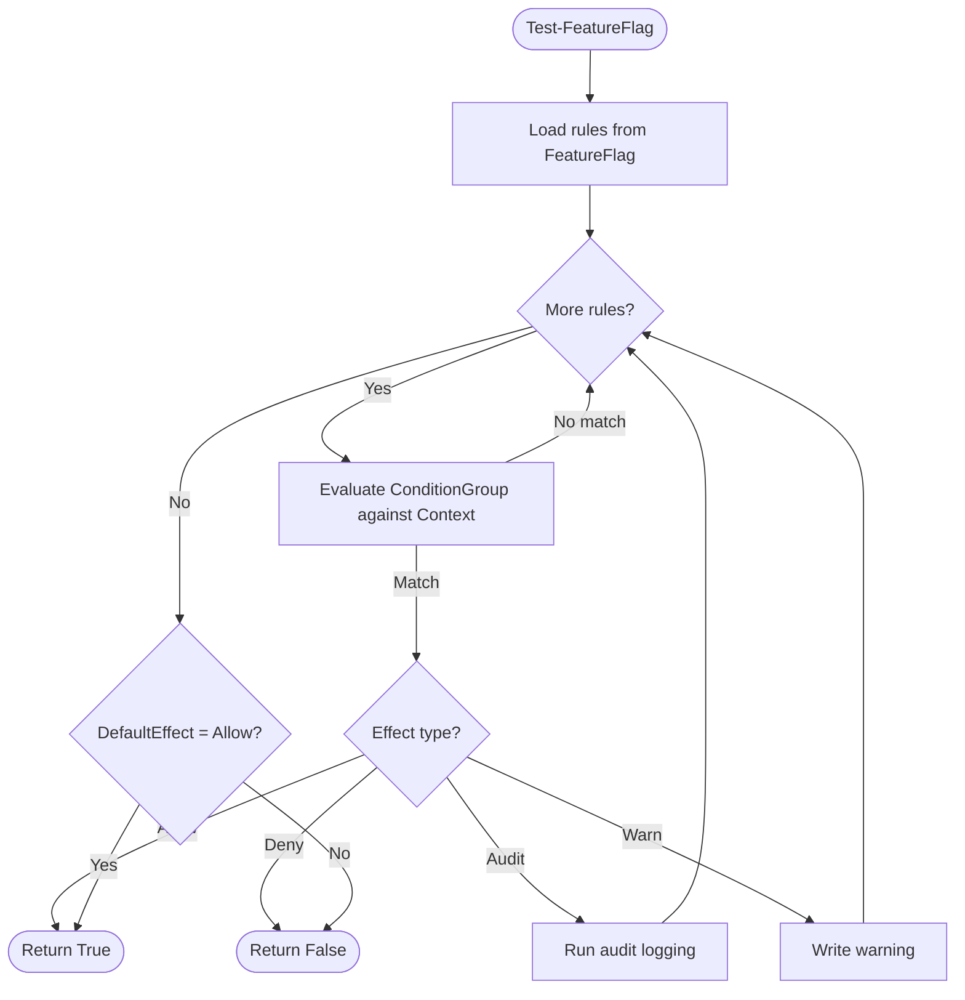

# Concepts

This page covers the core data model and terminology. Understanding these concepts makes everything else straightforward.

## Data model



## PropertySet

A **PropertySet** defines the vocabulary of your rules. Each property has a name, a type, and optional validation constraints.

| Field | Purpose | Example |
|-------|---------|---------|
| `Type` | Data type (`string`, `integer`, `boolean`) | `"string"` |
| `Enum` | Allowed values for strings | `["Production", "Staging"]` |
| `Validation` | Numeric/string constraints | `{ "Minimum": 0, "Maximum": 99 }` |

PropertySets are not tied to a specific feature. You define them once for your organization and reuse them across flags.

## Context

A **Context** is a hashtable whose keys match property names from your PropertySet. It represents the current state of a device, environment, or user.

```powershell
$context = @{
    Environment = 'Production'
    Tier        = 2
    IsCompliant = $true
}
```

Context is entirely user-provided. Gatekeeper doesn't collect or assume any values -- you bring your own from scripts, APIs, config management tools, or manual input.

## FeatureFlag

A **FeatureFlag** is a named collection of rules with metadata. Key fields:

| Field | Purpose |
|-------|---------|
| `Name` | Unique identifier |
| `Description` | Human-readable purpose |
| `Version` | Track changes to the flag |
| `Author` | Contact for questions |
| `DefaultEffect` | Outcome when no Allow/Deny rule matches |
| `Rules` | Ordered list of rules to evaluate |

Flags are serialized as JSON and validated against a JSON Schema.

## Rule

A **Rule** pairs a condition with an effect. Rules are evaluated **top-down** in the order they appear.



## ConditionGroup

A **ConditionGroup** is a logical expression that evaluates to true or false. It supports:

- **Single condition** -- compare one property: `Property + Operator + Value`
- **AllOf** -- all child conditions must be true (logical AND)
- **AnyOf** -- at least one child must be true (logical OR)
- **Not** -- inverts the child condition (logical NOT)

Groups nest recursively, so you can express conditions like:

> Allow if (Environment is Staging) AND (IsCompliant is true OR Percentage < 10)

### Operators

| Operator | Description |
|----------|-------------|
| `Equals` | Exact match |
| `NotEquals` | Not an exact match |
| `GreaterThan` | Numeric greater-than |
| `GreaterThanOrEqual` | Numeric greater-than-or-equal |
| `LessThan` | Numeric less-than |
| `LessThanOrEqual` | Numeric less-than-or-equal |
| `In` | Value is in a list |
| `NotIn` | Value is not in a list |

## Effect

The **Effect** determines what happens when a rule's conditions match.

| Effect | Behavior | Stops evaluation? |
|--------|----------|:-:|
| `Allow` | Feature is enabled | Yes |
| `Deny` | Feature is disabled | Yes |
| `Audit` | Logs the match, continues evaluating | No |
| `Warn` | Writes a warning, continues evaluating | No |

!!! note
    `Audit` and `Warn` are observability tools. They let you monitor which rules *would* match without changing the outcome. Use them during rollout planning.

## How it all fits together



## Next steps

- [Creating Feature Flags](creating-flags.md) -- build conditions and rules step by step
- [How Evaluation Works](evaluation.md) -- detailed walkthrough of the rule engine
