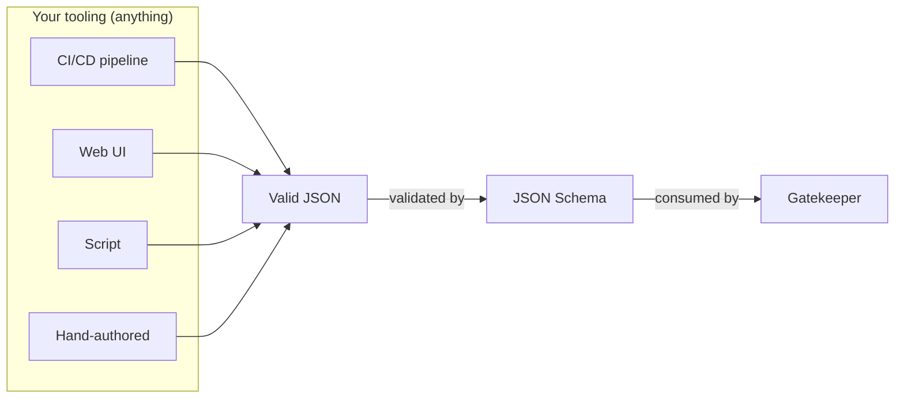
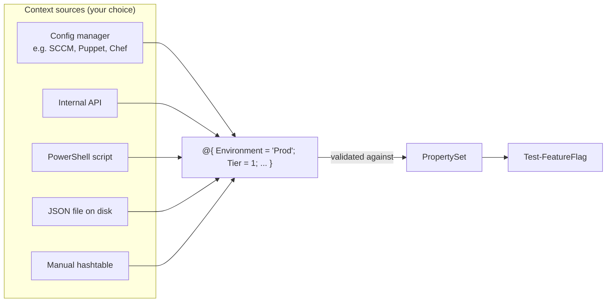

# Design Philosophy

Gatekeeper is deliberately unopinionated about where your data comes from. Every input -- feature flags, property sets, and device context -- is designed to be **created, stored, and distributed however you want**. The only contract is the schema.

## Schema as the contract

Feature flags and property sets are JSON files validated against [JSON Schema](https://json-schema.org/). This means any tool that produces valid JSON can create them:

- A CI/CD pipeline that generates flags from a release manifest
- A web UI that lets product managers toggle features
- A script that pulls flag definitions from an API
- A text editor and a human

As long as the output validates against the schema, Gatekeeper will consume it.



Gatekeeper ships commands like `New-FeatureFlag`, `New-PropertySet`, and `New-Rule` to make authoring convenient from PowerShell, but they're not required. The JSON schemas are published and versioned so external tools can validate independently:

- **Feature flags**: `https://raw.githubusercontent.com/HeyItsGilbert/Gatekeeper/main/Gatekeeper/Schemas/FeatureFlag.json`
- **Property sets**: `https://raw.githubusercontent.com/HeyItsGilbert/Gatekeeper/main/Gatekeeper/Schemas/Properties.json`

Point your editor or CI tool at these schemas and you get autocomplete and validation for free.

## Bring your own context

The most important "bring your own" surface is the **device context**. Context is just a hashtable. Gatekeeper doesn't know or care how you build it.



The only requirement: the hashtable keys must match property names defined in your PropertySet, and the values must pass the type and validation rules you configured.

### Examples

**From a config management tool:**

```powershell
# Pull context from your existing tooling
$ohai = Get-OhaiData  # or SCCM, Puppet facts, DSC, etc.
$context = @{
    Environment = $ohai.environment
    Tier        = $ohai.tier
    IsCompliant = (Test-Compliance)
}
```

**From an API:**

```powershell
$device = Invoke-RestMethod "https://inventory.contoso.com/api/devices/$env:COMPUTERNAME"
$context = @{
    Environment = $device.environment
    Tier        = $device.tier
    IsCompliant = $device.compliant
}
```

**From a file on disk:**

```powershell
$context = Get-Content './device-context.json' | ConvertFrom-Json -AsHashtable
```

**Hardcoded for testing:**

```powershell
$context = @{
    Environment = 'Staging'
    Tier        = 1
    IsCompliant = $true
}
```

All four produce the same thing: a hashtable that Gatekeeper validates and evaluates.

## Bring your own storage

Gatekeeper defaults to storing flags and property sets in machine-wide configuration folders, but you can override this entirely:

- Pass `-FilePath` to any `Read-*` or `Save-*` command
- Change `FilePaths.FeatureFlags` and `FilePaths.PropertySet` in your [configuration](configuration.md)
- Skip the filesystem and pass objects directly -- `Test-FeatureFlag` accepts in-memory `[FeatureFlag]` objects

This means your flags can live in:

- A git repository alongside your code
- A shared network drive
- A blob store pulled at runtime
- An internal API that returns JSON

## Bring your own distribution

Gatekeeper has no opinion on how flags reach your devices. JSON files are portable by nature. Common patterns:

| Method | How it works |
|--------|-------------|
| **Git repo** | Store flags in a repo, pull on each device via scheduled task or config management |
| **File share** | Drop JSON files on a network share, point Gatekeeper's config to it |
| **Config management** | Push flags via SCCM, Puppet, Chef, Ansible, DSC, etc. |
| **API + script** | Fetch flags from an API at runtime, pass the JSON to `Read-FeatureFlag` |
| **Manual copy** | Copy files to the device -- works for small-scale or testing |

## Bring your own logging

The [logging system](logging.md) follows the same principle. Gatekeeper ships with basic `Write-Host` / `Write-Warning` defaults, but you replace them with any script or script file:

- Write to a log file
- Send to a SIEM or log aggregator
- Post to a webhook
- Call an internal API

The logging script receives the matched `$Rule` object, so you have full context for your audit trail.

## Why this matters

This design means Gatekeeper fits into your existing infrastructure rather than replacing it. You don't need to adopt a new service, database, or SaaS platform. You keep your existing tools for:

- **Authoring** -- whatever produces valid JSON
- **Storage** -- wherever you keep configuration
- **Distribution** -- however you push config to devices
- **Context** -- whatever knows about your devices
- **Logging** -- wherever you send audit data

Gatekeeper is the evaluation engine in the middle. Everything else is yours.
