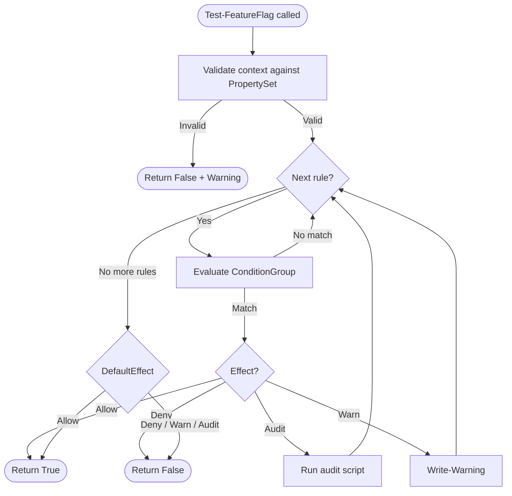
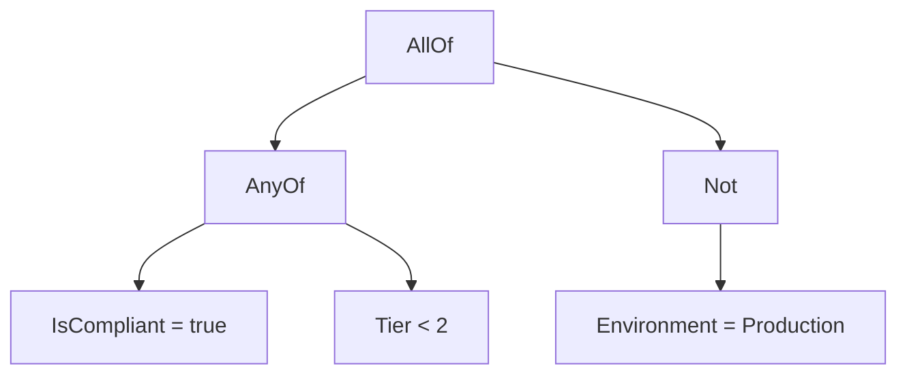

# How Evaluation Works

This page explains what happens inside `Test-FeatureFlag` when you evaluate a flag against a context.

## The evaluation loop



### Step by step

1. **Validate** -- each context value is checked against the PropertySet's type and validation rules. If any value fails, evaluation stops and returns `$false`.

2. **Iterate rules** -- rules are evaluated in order, top to bottom.

3. **Evaluate conditions** -- for each rule, the ConditionGroup is evaluated recursively against the context.

4. **Apply effect** -- if conditions match:
    - **Allow** or **Deny**: return immediately
    - **Audit** or **Warn**: execute the logging action and continue to the next rule

5. **Apply default** -- if no Allow/Deny rule matched, the `DefaultEffect` determines the outcome. Only `Allow` returns `$true`.

## Condition evaluation

Conditions are evaluated recursively through the ConditionGroup tree.

### Single condition

```json
{ "Property": "Environment", "Operator": "Equals", "Value": "Staging" }
```

Looks up `Environment` in the context, converts both values to the property's declared type, and compares using the operator.

### AllOf (AND)

```json
{
    "AllOf": [
        { "Property": "Environment", "Operator": "Equals", "Value": "Staging" },
        { "Property": "IsCompliant", "Operator": "Equals", "Value": "true" }
    ]
}
```

Every child must evaluate to true. Short-circuits on the first false.

### AnyOf (OR)

```json
{
    "AnyOf": [
        { "Property": "Tier", "Operator": "Equals", "Value": "1" },
        { "Property": "Tier", "Operator": "Equals", "Value": "2" }
    ]
}
```

At least one child must evaluate to true. Short-circuits on the first true.

### Not

```json
{
    "Not": [
        { "Property": "Environment", "Operator": "Equals", "Value": "Production" }
    ]
}
```

Inverts the result of the child condition.

### Nesting

These operators compose freely:

```json
{
    "AllOf": [
        {
            "AnyOf": [
                { "Property": "IsCompliant", "Operator": "Equals", "Value": "true" },
                { "Property": "Tier", "Operator": "LessThan", "Value": "2" }
            ]
        },
        {
            "Not": [
                { "Property": "Environment", "Operator": "Equals", "Value": "Production" }
            ]
        }
    ]
}
```

This reads as: **(compliant OR tier < 2) AND (NOT production)**.



## Walkthrough

Given this flag:

```json
{
    "Name": "NewFeature",
    "DefaultEffect": "Deny",
    "Rules": [
        { "Name": "Audit Prod", "Effect": "Audit",
          "Conditions": { "Property": "Environment", "Operator": "Equals", "Value": "Production" } },
        { "Name": "Allow Staging", "Effect": "Allow",
          "Conditions": { "Property": "Environment", "Operator": "Equals", "Value": "Staging" } }
    ]
}
```

And this context: `@{ Environment = 'Production' }`

| Step | Rule | Condition match? | Effect | Result |
|------|------|:---:|--------|--------|
| 1 | Audit Prod | Yes | Audit | Log, continue |
| 2 | Allow Staging | No | -- | Skip |
| 3 | *(no more rules)* | -- | DefaultEffect = Deny | **Return False** |

The device in Production gets audited but denied. Change the context to `Staging` and rule 2 matches, returning `$true`.

## Safety defaults

Gatekeeper is deliberately cautious:

- If context validation fails, the result is `$false`
- If no Allow/Deny rule matches, the result depends on DefaultEffect
- DefaultEffect of `Warn` or `Audit` still returns `$false` -- only explicit `Allow` returns `$true`
- Missing context keys cause evaluation to fail with a warning
